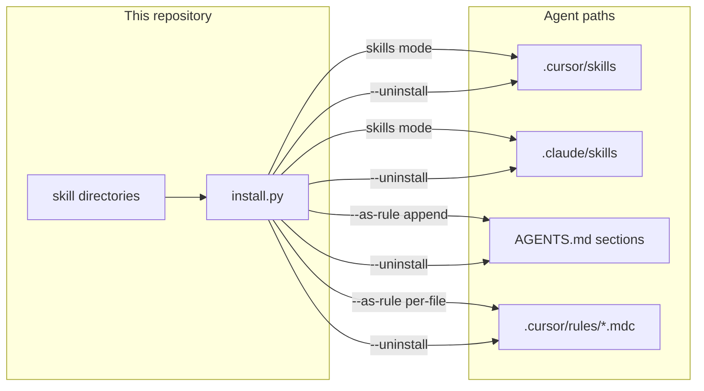

# Architecture

High-level view of how this repository is organized and how `install.py` moves portable [Agent Skills](https://agentskills.io/) into **any supported coding agent** — not a single vendor or IDE.

Each skill is a standard `<skill>/SKILL.md` directory. The installer maps that same source into tool-specific paths (`.cursor/skills/`, `.claude/skills/`, `.agents/skills/`, and 16 other layouts). See [Supported coding tools](features/supported-tools.md) for the full agent list.

## Repository layout

```
skills/
├── README.md                 # Short entry point (links to docs/)
├── USAGE.md                  # Per-tool usage guide
├── install.py                # Cross-platform installer / uninstaller
├── skill_categories.py       # Category groupings for --list-by-category
├── skill_validate.py         # Frontmatter, links, and body checks
├── <skill>/                  # One directory per skill
│   └── SKILL.md              # Required: frontmatter + instructions
├── docs/                     # Project documentation (catalog, guides, architecture)
├── scripts/                  # Maintenance helpers (README skill count sync)
└── tests/                    # pytest suite (install + per-skill validation)
```

Each skill is a self-contained directory. Optional files (`examples.md`, `checklist.md`, `scripts/`) sit alongside `SKILL.md`.

## Install and uninstall



**Install** discovers skills, resolves target agents (auto-detect or `-a`), then symlinks or copies directories, or converts `SKILL.md` to tool-specific rules.

**Uninstall** uses the same path resolution. It removes skill directories, per-file rules, or marked append sections. It does not modify source skills in this repo.

## Validation pipeline

CI runs on every change to skills, tests, or validation code:

1. `discover_skills()` finds every `<skill>/SKILL.md`
2. `skill_validate.py` checks frontmatter, body length, and internal links
3. `tests/test_skills.py` exercises install and rule conversion per skill
4. `tests/test_install.py` covers installer edge cases including uninstall
5. `scripts/sync_readme_skill_count.py` keeps README and skills-catalog counts in sync

See [Skill testing](features/skill-testing.md) for details.

## Related

- [Installer](features/installer.md)
- [Supported coding tools](features/supported-tools.md)
- [Getting started](getting-started.md)
