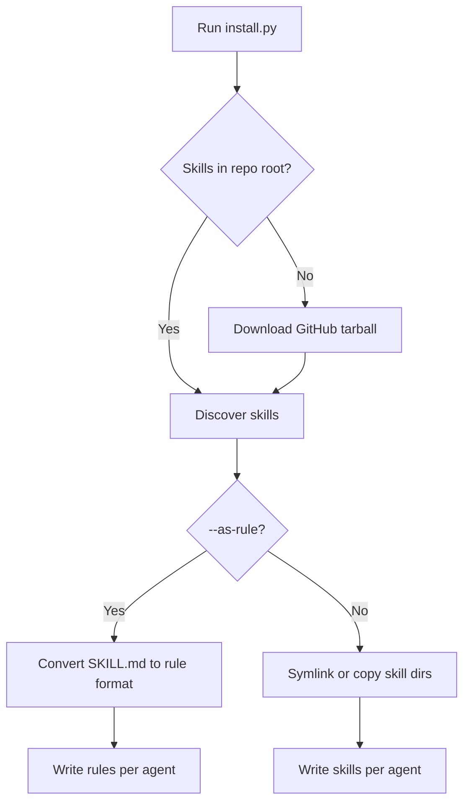

# Installer

Cross-platform Python script that installs skills from this repository into AI coding tools on macOS, Windows, and Linux.

## Overview

`install.py` replaces the former `install.sh` and `install.ps1` scripts with a single stdlib-only Python entry point. It requires Python 3.10+ (included on most systems or available from [python.org](https://www.python.org/downloads/)).

Behavior matches the previous installers:

- Discover skills in this repo (`<skill>/SKILL.md` directories)
- Install to project-local or global agent paths
- Symlink (default) or copy skill directories
- Convert skills to tool-specific rules with `--as-rule`
- Fetch skills from GitHub when run outside a clone

## Usage

From a clone:

```bash
python3 install.py --list
python3 install.py --all                          # auto-detect installed tools
python3 install.py --all -g -y                    # global install, no prompts
python3 install.py -s docker -a cursor -a claude-code -a opencode
python3 install.py -s test -a cursor --as-rule
```

Windows (Command Prompt or PowerShell):

```powershell
python install.py --list
python install.py --all -y
python install.py -s docker -a cursor -a claude-code
```

One-liner without cloning (requires Python 3.10+):

```bash
curl -sL https://raw.githubusercontent.com/brianlechthaler/skills/main/install.py -o install.py
python3 install.py --all -y
```

## Configuration

| Option / env var | Default | Description |
|------------------|---------|-------------|
| `--list` | — | List skills in this repo |
| `--list-agents` | — | Show supported tools and install paths |
| `-s`, `--skill` | all | Install specific skill(s); repeatable |
| `--all` | — | Install every skill |
| `-a`, `--agent` | auto-detect | Target tool(s) or `all` |
| `-g`, `--global` | project-local | Install to user home dirs |
| `--copy` | symlink | Copy files instead of symlinking |
| `--as-rule` | skills mode | Install as AI rules instead of skills |
| `-y`, `--yes` | prompt | Skip confirmation |
| `SKILLS_REPO_ROOT` | script directory | Override repo root |
| `SKILLS_GITHUB_REPO` | `brianlechthaler/skills` | GitHub repo for remote fetch |
| `SKILLS_GITHUB_BRANCH` | `main` | Branch for remote fetch |

## Request flow



## Security

Remote install downloads only from `https://github.com/` tarballs. Archive members are validated for path traversal before extraction. Skill names and GitHub repo/branch env vars are validated to block `..` segments.

## Troubleshooting

**`python3: command not found`** — Install Python 3.10+ or use `python` instead of `python3` on Windows.

**Symlink fails on Windows** — The installer falls back to copy automatically. Use `--copy` to skip symlink attempts.

**No skills found** — Run from the repo root or set `SKILLS_REPO_ROOT`. Without a local clone, the script fetches from GitHub.

## Related

- [Supported coding tools](supported-tools.md) — all 19 tools, paths, auto-detection, and rule formats
- [USAGE.md](../../USAGE.md) — per-tool install paths and skills vs rules
- [README.md](../../README.md) — project overview
