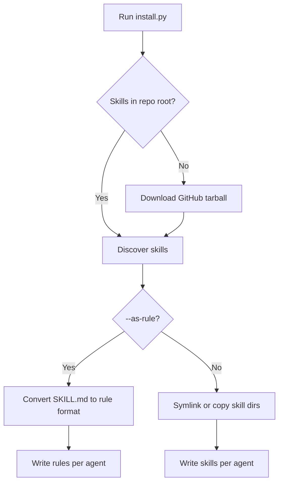
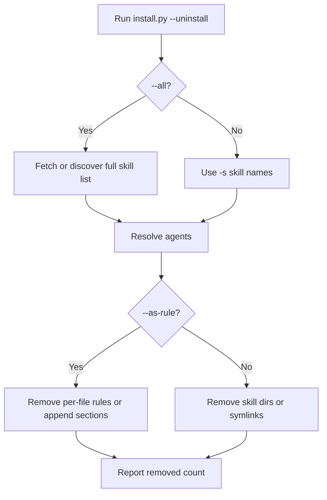

# Installer

Cross-platform Python script that installs and removes skills from this repository in AI coding tools on macOS, Windows, and Linux.

## Overview

`install.py` replaces the former `install.sh` and `install.ps1` scripts with a single stdlib-only Python entry point. It requires Python 3.10+ (included on most systems or available from [python.org](https://www.python.org/downloads/)).

Capabilities:

- Discover skills in this repo (`<skill>/SKILL.md` directories)
- Install to project-local or global agent paths
- Symlink (default) or copy skill directories
- Convert skills to tool-specific rules with `--as-rule`
- Remove installed skills or rules with `--uninstall`
- Fetch skills from GitHub when run outside a clone

## Install

From a clone:

```bash
python3 install.py --list
python3 install.py --all                          # auto-detect installed tools
python3 install.py --all -g -y                    # global install, no prompts
python3 install.py -s docker -a cursor -a claude-code -a opencode
python3 install.py -s test -a cursor --as-rule
```

Windows (Command Prompt or PowerShell):

```powershell
python install.py --list
python install.py --all -y
python install.py -s docker -a cursor -a claude-code
```

One-liner without cloning (requires Python 3.10+):

```bash
curl -sL https://raw.githubusercontent.com/brianlechthaler/skills/main/install.py -o install.py
python3 install.py --all -y
```

### Install flow



## Uninstall

`--uninstall` removes skills or rules that were installed by this script. It mirrors the install flow: same agent paths, scope flags, and mode flags.

### Basic usage

Remove one skill from Cursor:

```bash
python3 install.py --uninstall -s docker -a cursor -y
```

Remove multiple skills from multiple tools:

```bash
python3 install.py --uninstall -s docker -s test -a cursor -a claude-code -y
```

Remove every skill from this repo for one tool (global scope):

```bash
python3 install.py --uninstall --all -a cursor -g -y
```

Remove skills that were installed as rules:

```bash
python3 install.py --uninstall -s test -a cursor --as-rule -y
```

### Requirements

| Flag | Required for uninstall | Notes |
|------|------------------------|-------|
| `--uninstall` | Yes | Switches to remove mode |
| `-s` / `--skill` | Yes, unless `--all` | Repeat `-s` for multiple skills |
| `--all` | Alternative to `-s` | Uninstalls every skill listed in this repo |
| `-a` / `--agent` | No | Auto-detects installed tools when omitted |
| `-g` / `--global` | No | Use when skills were installed globally |
| `--as-rule` | No | Use when skills were installed as rules, not skill directories |
| `-y` / `--yes` | No | Skip the confirmation prompt |

You do **not** need a local clone to uninstall specific skills by name. The installer only fetches the repo tarball when you pass `--all` (to discover the full skill list).

### What gets removed

| Install mode | Uninstall behavior |
|--------------|-------------------|
| **Skills** (default) | Deletes the skill directory or symlink at `<agent-skills-path>/<skill>/` |
| **Rules, per-file** (`--as-rule`) | Deletes `.cursor/rules/<skill>.mdc`, `.claude/rules/<skill>.md`, and similar per-tool rule files |
| **Rules, append mode** (`--as-rule`) | Removes the HTML comment block between `<!-- skills-install:<skill>:begin -->` and `<!-- skills-install:<skill>:end -->` in `AGENTS.md`, `GEMINI.md`, `copilot-instructions.md`, etc. |

Safety checks:

- Skips paths that are not skill directories (no `SKILL.md` inside)
- Reports "not installed" and continues when a skill is missing for an agent
- Does not delete the source skill directories in this repository

### Uninstall flow



### After uninstall

Restart your coding tool or start a new session so it stops loading removed skills or rules.

For manual cleanup (copied installs, partial rule edits, or installs done without the script), see [Updating and removing](../../USAGE.md#updating-and-removing) in `USAGE.md`.

## Configuration

| Option / env var | Default | Description |
|------------------|---------|-------------|
| `--list` | — | List skills in this repo |
| `--list-by-category` | — | List skills grouped by category |
| `--list-agents` | — | Show supported tools and install paths |
| `-s`, `--skill` | all (install) | Skill name(s); repeatable |
| `--all` | — | Every skill in this repo |
| `-a`, `--agent` | auto-detect | Target tool(s) or `all` |
| `-g`, `--global` | project-local | Install to user home dirs |
| `--copy` | symlink | Copy files instead of symlinking |
| `--as-rule` | skills mode | Install or remove as AI rules |
| `--uninstall` | — | Remove installed skill(s) or rule(s) |
| `-y`, `--yes` | prompt | Skip confirmation |
| `SKILLS_REPO_ROOT` | script directory | Override repo root |
| `SKILLS_GITHUB_REPO` | `brianlechthaler/skills` | GitHub repo for remote fetch |
| `SKILLS_GITHUB_BRANCH` | `main` | Branch for remote fetch |

## Troubleshooting

**`python3: command not found`** — Install Python 3.10+ or use `python` instead of `python3` on Windows.

**Symlink fails on Windows** — The installer falls back to copy automatically. Use `--copy` to skip symlink attempts.

**No skills found** — Run from the repo root or set `SKILLS_REPO_ROOT`. Without a local clone, the script fetches from GitHub.

**Uninstall reports "not installed"** — Check scope (`-g` vs project-local) and mode (`--as-rule` vs skills). Run `python3 install.py --list-agents` to confirm paths.

**`specify skill(s) with -s/--skill or use --all`** — Uninstall requires at least one skill name or `--all`.

**Append-mode rule still visible** — Pass `--as-rule` on uninstall. The installer only removes marked sections it created.

## Security

Remote install downloads only from `https://github.com/` tarballs. Archive members are validated for path traversal before extraction. Skill names and GitHub repo/branch env vars are validated to block `..` segments.

## Related

- [Getting started](../getting-started.md) — first-time setup, install, verify, uninstall
- [Supported coding tools](supported-tools.md) — all 19 tools, paths, auto-detection, and rule formats
- [USAGE.md](../../USAGE.md) — per-tool guide, skills vs rules, manual removal
- [README.md](../../README.md) — project overview and skill catalog
