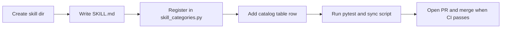

# Skill authoring

Add a new portable skill to this repository.

## Overview

Each skill is a directory with a required `SKILL.md` file following the [Agent Skills open standard](https://agentskills.io/). Skills are grouped in [skill_categories.py](../../skill_categories.py) and listed in the [skills catalog](skills-catalog.md). CI validates frontmatter, links, install paths, and rule conversion for every skill.

## Workflow



1. Create a directory named after the skill (lowercase, hyphens).
2. Add `SKILL.md` with YAML frontmatter (`name`, `description`) and instructions.
3. Add the skill to `skill_categories.py` under one category.
4. Add a row to the matching category table in [skills-catalog.md](skills-catalog.md).
5. Run validation (see below).
6. Open a feature-branch PR and merge when CI is green.

For the full agent workflow, see the [skill-create](../../skill-create/SKILL.md) skill.

## SKILL.md requirements

| Field | Rule |
|-------|------|
| `name` | Must match the directory name exactly |
| `description` | At least 20 characters; include when-to-use trigger phrases |
| Body | Markdown instructions; internal links must resolve |

Optional files (`examples.md`, `checklist.md`, `scripts/`) can sit alongside `SKILL.md`.

## Validation

```bash
python3 -m pytest tests/test_skills.py -v
python3 scripts/sync_readme_skill_count.py --check
python3 -m ruff check install.py skill_categories.py skill_validate.py scripts/ tests/
```

The sync script updates skill-count markers in `README.md` and [skills-catalog.md](skills-catalog.md). Run it without `--check` after adding a skill:

```bash
python3 scripts/sync_readme_skill_count.py
```

## Tool-specific notes

Skills work across 19 agents. Author for the portable format first; the installer handles tool-specific paths and rule conversion. See [Supported coding tools](supported-tools.md) for agent IDs and install paths.

- [Agent Skills specification](https://agentskills.io/)
- [Cursor skills docs](https://cursor.com/docs/context/skills)
- [Claude Code skills](https://code.claude.com/docs/en/skills)
- [OpenCode skills](https://opencode.ai/docs/skills)
- [Codex skills](https://developers.openai.com/codex/skills)

## Related

- [Skills catalog](skills-catalog.md)
- [Skill testing](skill-testing.md)
- [Architecture](../architecture.md)
