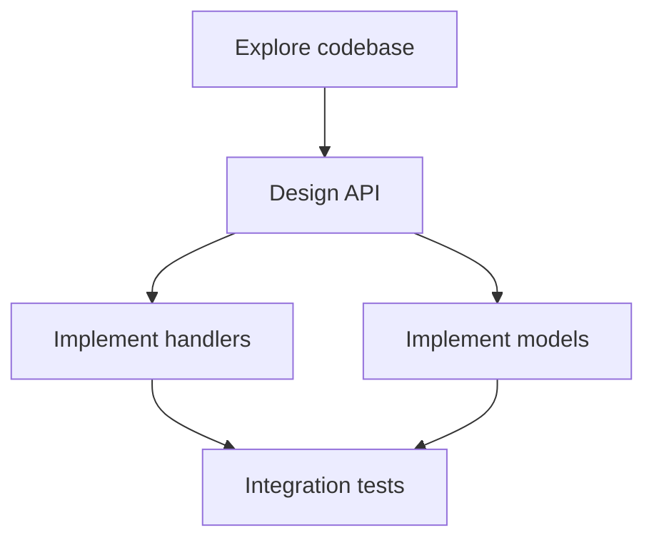

# Orchestrate

## Core Rules

1. **Plan first, execute second.** Never launch subagents until scope, dependencies, and phases are mapped.
2. **Parallelize within a phase only.** Tasks in the same phase must have no ordering dependency and no conflicting writes.
3. **One writer per artifact.** Two subagents must not edit the same file, module, or config surface in the same phase.
4. **Gate on completion.** Finish and synthesize a phase before starting the next. Do not start Phase N+1 while Phase N outputs are still unknown.
5. **Parent owns integration.** Subagents explore or implement slices; the parent merges results, resolves conflicts, and runs verification.

## When This Applies

| Use orchestrate | Skip orchestrate |
|-----------------|------------------|
| Multi-file features, refactors, audits, migrations | Single-file typo or one-liner fix |
| User asks for parallel agents or faster delivery | Pure Q&A with no implementation |
| Work spans explore → implement → test → docs | Task fits in one focused pass |
| Independent subtasks can run concurrently | Strong serial dependency throughout |

When unsure, **plan anyway** — even a short plan prevents wasted parallel work.

## Workflow

Copy and track:

```
Orchestrate progress:
- [ ] Scope and success criteria defined
- [ ] Dependency map drawn
- [ ] Phased execution plan written
- [ ] Phase 1 launched (parallel where safe)
- [ ] Phase 1 synthesized and verified
- [ ] Remaining phases executed with gates
- [ ] Final integration and verification
```

### 1. Scope and success criteria

Before planning, nail down:

- **Goal** — what "done" looks like in user-visible terms
- **Constraints** — tests, lint, no unrelated changes, commit/PR rules
- **Inputs needed** — files, APIs, env, user decisions
- **Out of scope** — explicit exclusions to avoid scope creep

If critical unknowns block planning, resolve them with one round of readonly `explore` subagents or targeted reads — not full implementation.

### 2. Decompose into a dependency map

Break work into **atomic tasks**. For each task record:

| Field | Meaning |
|-------|---------|
| ID | Short label (`T1`, `auth-api`, …) |
| Description | One clear outcome |
| Reads | Files/data it needs |
| Writes | Files/data it mutates |
| Depends on | Task IDs that must finish first |
| Parallel group | Phase number; same phase ⇒ may run together |

Draw ordering explicitly:



**Hard dependency rules:**

| Must be sequential | Safe to parallelize |
|------------------|---------------------|
| Explore before implement | Readonly exploration of unrelated areas |
| Schema/migration before code using it | Independent modules with separate write targets |
| Implement before test | Lint on module A while tests run on module B |
| Build before deploy/publish | Docs for feature A while coding feature B (different files) |
| User decision before branching implementation | CI investigation + security review (readonly) |

**Race-condition red flags — never parallelize:**

- Two tasks writing the same file or export surface
- Implement + refactor of the same module
- Migration + code assuming new schema before migration lands
- Git operations (commit/push/rebase) alongside edits to the same branch
- Parent and child both mutating the same artifact

When two tasks might touch the same area, **serialize them** or **split by directory** with explicit file ownership in the subagent prompt.

### 3. Write the step-by-step execution plan

Present the plan before launching mutating work. Use this template:

```markdown
## Execution plan

**Goal:** [one sentence]

### Phase 1 — [name] (parallel: yes/no)
| Task | Agent type | Depends on | Writes |
|------|------------|------------|--------|
| … | explore / generalPurpose / shell / … | — | — |

### Phase 2 — [name] (parallel: yes/no)
…

### Verification
- [ ] [specific command or check]

### Risks / serial gates
- [what must not run in parallel and why]
```

Keep phases small. Prefer **more phases with safe parallelism** over **fewer phases with risky parallelism**.

### 4. Launch subagents per phase

**Within a phase**, send **one message with multiple Task tool calls** — one per parallel task. Do not drip-launch unless a later task depends on an earlier result in the same phase.

**Subagent prompt checklist** (subagents do not see the user message or prior turns):

- Goal and exact deliverable
- Relevant paths, patterns, conventions
- Readonly vs mutating scope
- Files this agent **owns** (writes) and files to **avoid**
- Output format expected back (findings list, patch summary, command output)
- Constraints from user rules and other skills

**Agent type selection:**

| Type | Use for |
|------|---------|
| `explore` | Codebase search, mapping, readonly discovery |
| `generalPurpose` | Multi-step implementation or mixed read/write |
| `shell` | Git, builds, scripted commands |
| `ci-investigator` | Single failing CI check diagnosis |
| `bugbot` / `security-review` | Explicit review requests (readonly) |
| `best-of-n-runner` | Isolated parallel experiments |

Do **not** delegate the entire user request to one subagent and return its result. The parent plans, integrates, and verifies.

### 5. Synthesize after each phase

When parallel tasks complete:

1. **Merge findings** — dedupe, resolve contradictions
2. **Check gates** — did every task produce what the next phase needs?
3. **Apply integration** — parent makes cohesive edits when subagents produced fragments
4. **Reconcile conflicts** — if two agents disagreed, investigate before proceeding
5. **Update the plan** — mark phase done; adjust later phases if new facts emerged

Only then start the next phase.

### 6. Final verification

Run verification **after** all implementation phases:

- Tests, lint, typecheck (follow [test](../test/SKILL.md) and [lint](../lint/SKILL.md) when applicable)
- End-to-end or browser checks when UI changed ([browser-test](../browser-test/SKILL.md))
- Diff review — scope matches plan, no duplicate or orphaned changes

Report: what shipped, what was deferred, and any follow-ups.

## Parallel launch pattern

**Correct — Phase 1 explore, three independent areas:**

```
Single assistant message:
  Task(explore): map auth flow in src/auth/
  Task(explore): map API routes in src/api/
  Task(explore): list existing tests in tests/
→ wait for all → synthesize → write Phase 2 plan
```

**Correct — Phase 2 implement, separate modules:**

```
Single assistant message:
  Task(generalPurpose): implement UserService in src/services/user.ts (only this file)
  Task(generalPurpose): implement UserRepository in src/repos/user.ts (only this file)
→ wait for all → parent wires imports → run tests
```

**Wrong — race condition:**

```
Task: refactor src/utils.ts
Task: add feature using src/utils.ts   ← same file / unclear ownership
```

**Wrong — cart before horse:**

```
Task: write integration tests for new endpoint
Task: implement new endpoint                  ← tests before implementation exists
```

Fix by moving tests to a later phase with `Depends on: implement endpoint`.

## Planning heuristics

| Project shape | Typical phases |
|---------------|----------------|
| New feature | explore → design/plan → implement (parallel by module) → test → docs |
| Bug fix | reproduce/explore → fix → test |
| Refactor | explore usage → migrate slice by slice → test each slice |
| Audit/review | parallel readonly probes → consolidate findings → remediate serially by risk |
| CI failure | ci-investigator (+ optional explore) → fix → verify |

**Readonly before mutating.** Exploration phases are highly parallelizable. Implementation phases parallelize only across disjoint write sets.

**Minimize phase count only when safe.** A serial bottleneck (shared file, shared design decision) is cheaper than a merge conflict or broken build.

## Anti-patterns

| Anti-pattern | Instead |
|--------------|---------|
| Launch agents before a plan exists | Write dependency map and phased plan first |
| Parallel edits to same file | Serialize or assign single owner |
| Skip synthesis between phases | Always merge and gate |
| Full request delegated to one subagent | Parent orchestrates; subagents do slices |
| Ignore failed subagent | Block next phase; retry or revise plan |
| Parallel git writes | One shell agent owns git per phase |
| Speculative implement while exploring | Finish explore phase first |

## Additional resources

- Concrete scenarios: [examples.md](examples.md)
